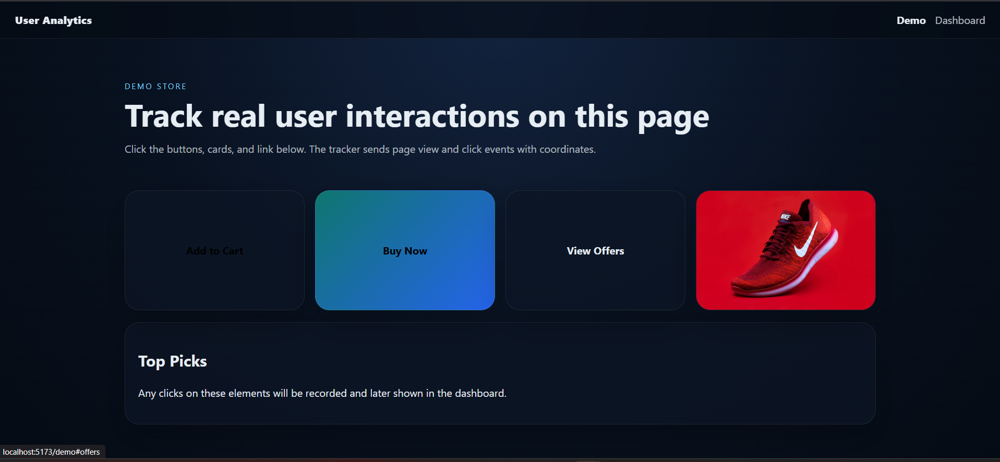
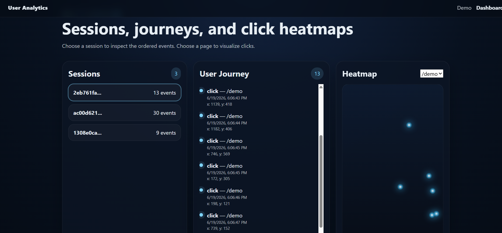
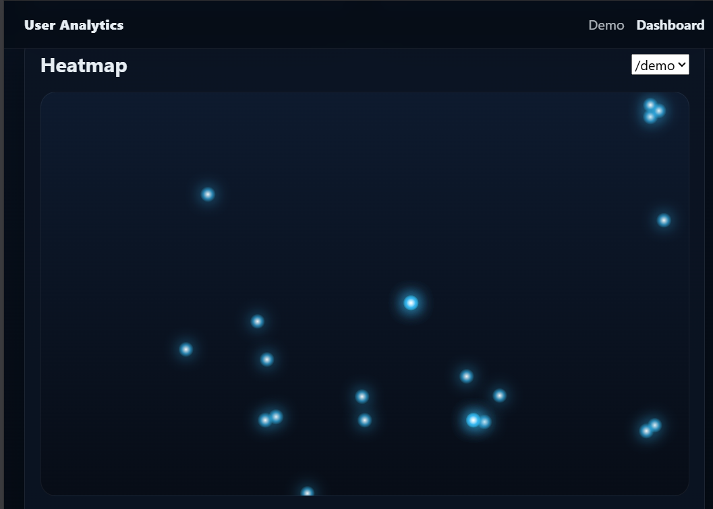

# User Analytics Application

A full-stack analytics platform that tracks user interactions on a webpage and visualizes user behavior through session tracking, user journey analysis, and click heatmaps.

Built for the **CausalFunnel Full Stack Engineer Assessment**.

---

## Features

### Event Tracking

* Track `page_view` events
* Track `click` events
* Generate unique session IDs using browser localStorage
* Capture click coordinates (x, y)
* Record page URL and timestamp
* Send events to the backend API in real time

### Session Analytics

* View all tracked sessions
* Display total events per session
* Select a session to inspect the complete user journey

### User Journey Visualization

* Chronological event timeline
* Page views and clicks
* Event timestamps
* Click coordinate details

### Click Heatmap

* Aggregate click data by page URL
* Visualize user interaction hotspots
* Render click positions on a heatmap

### Demo Environment

* Dedicated demo page for generating analytics events
* Interactive buttons, links, and cards for testing

---

## System Architecture

```text
User Interacts With Demo Page
            │
            ▼
     Analytics Tracker
            │
            ▼
      Express API
            │
            ▼
        MongoDB
            │
            ▼
     Analytics Dashboard
            │
     ┌──────┼──────┐
     ▼      ▼      ▼
 Sessions Journey Heatmap
```

---

## Tech Stack

### Frontend

* React.js
* React Router
* Vite
* CSS3

### Backend

* Node.js
* Express.js

### Database

* MongoDB Atlas
* Mongoose

### Tracking

* Vanilla JavaScript Analytics Script

### Development Tools

* Git
* GitHub

---

## Project Structure

```text
user-analytics-app
│
├── client
│   ├── src
│   │   ├── components
│   │   ├── pages
│   │   ├── services
│   │   └── tracker
│   └── public
│
├── server
│   ├── src
│   │   ├── config
│   │   ├── controllers
│   │   ├── middleware
│   │   ├── models
│   │   └── routes
│
├── screenshots
│
└── README.md
```

---

## Setup Instructions

### 1. Clone Repository

```bash
git clone https://github.com/ankitmrj/CausalFunnel-Assesement-.git
cd CausalFunnel-Assesement-
```

---

### 2. Backend Setup

Navigate to the server directory:

```bash
cd server
npm install
```

Create a `.env` file inside the `server` folder:

```env
PORT=5000
MONGODB_URI=your_mongodb_connection_string
```

Start the backend server:

```bash
npm start
```

Expected output:

```text
MongoDB connected
Server running on port 5000
```

---

### 3. Frontend Setup

Open a new terminal:

```bash
cd client
npm install
npm run dev
```

Expected output:

```text
Local: http://localhost:5173
```

---

## Usage

### Generate Analytics Events

Open:

```text
http://localhost:5173/demo
```

Perform actions such as:

* Refresh the page
* Click buttons
* Click links
* Interact with cards

These actions generate analytics events and store them in MongoDB.

---

### View Dashboard

Open:

```text
http://localhost:5173/dashboard
```

Dashboard Features:

* Sessions View
* User Journey Timeline
* Click Heatmap
* Event Counts

---

## API Endpoints

### Track Event

```http
POST /api/events
```

### Get Sessions

```http
GET /api/sessions
```

### Get Session Events

```http
GET /api/sessions/:sessionId/events
```

### Get Heatmap Data

```http
GET /api/heatmap?page=/demo
```

---

## Database Schema

```javascript
{
  session_id: String,
  event_type: String,
  page_url: String,
  timestamp: Date,
  x: Number,
  y: Number
}
```

---

## Screenshots

### Demo Page



### Dashboard




### Heatmap



---

## Assumptions

* Session IDs are stored in browser localStorage.
* A session remains active until localStorage is cleared.
* Heatmap coordinates are based on browser viewport coordinates.
* Only `page_view` and `click` events are tracked.
* A single demo page is used to generate test data.
* Click coordinates are collected relative to the user's viewport.

---


### Heatmap Implementation

A lightweight dot-based heatmap visualization was implemented instead of a dedicated heatmap engine. This keeps the implementation simple while still satisfying the assignment requirements.

### Session Management

Browser localStorage was chosen over cookies because it provides a straightforward way to persist session identifiers across page reloads.

---


## Assignment Requirements Covered

### Event Tracking

* Page View Tracking
* Click Tracking
* Session Tracking
* Timestamp Recording
* Coordinate Capture

### Backend APIs

* Store Events
* List Sessions
* Fetch Session Events
* Fetch Heatmap Data

### Database

* MongoDB Storage
* Queryable Event Schema

### Dashboard

* Sessions View
* User Journey View
* Heatmap View


